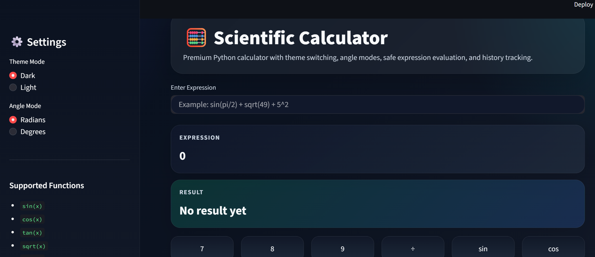

# 🧮 Scientific Calculator

[](https://www.python.org/)
[](https://streamlit.io/)
[]()
[]()

A modern scientific calculator built with **Python** and **Streamlit**, featuring a clean interface, theme switching, angle mode selection, safe mathematical expression evaluation, and calculation history.

---

## 📌 Overview

This project is a web-based scientific calculator designed to provide both **basic arithmetic** and **advanced mathematical functions** in an interactive and visually polished interface. It is suitable for learning, portfolio presentation, and deployment as a lightweight Python web application.

The calculator supports:

- basic mathematical operations
- scientific functions
- radians and degrees mode
- dark and light theme switching
- safe expression handling
- answer history tracking

---
---

## 🌐 Live Demo

🔗 **Deployed App:**  
[Scientific Calculator](https://scientific-calculator-wajiha.streamlit.app/)

---

## ✨ Features

- Basic arithmetic operations: `+`, `-`, `*`, `/`, `%`
- Scientific operations:
  - `sin(x)`
  - `cos(x)`
  - `tan(x)`
  - `sqrt(x)`
  - `log(x)`
  - `ln(x)`
  - `factorial(x)`
  - `abs(x)`
  - `exp(x)`
- Constants support:
  - `pi`
  - `e`
- Angle mode switching:
  - Radians
  - Degrees
- Dark and light UI modes
- Safe expression evaluation using Python AST
- Calculation history panel
- Clean layout built with Streamlit
- Ready for GitHub and Streamlit Cloud deployment

---

## 🖼️ Interface Preview

```md

```

---

## 🛠️ Tech Stack

- **Python**
- **Streamlit**
- **AST (Abstract Syntax Tree)** for safe expression parsing
- **Custom CSS styling** for UI design

---

## 📂 Project Structure

```text
scientific-calculator/
│
├── app.py
├── calculator.py
├── requirements.txt
├── .gitignore
└── README.md
```

---

## ⚙️ How It Works

The project is divided into two main parts:

### `app.py`

This file handles:

- the Streamlit web interface
- calculator buttons
- input display
- theme switching
- angle mode selection
- result display
- history tracking

### `calculator.py`

This file handles:

- safe mathematical evaluation
- allowed operators
- allowed functions
- constants like `pi` and `e`
- validation for factorial and other expressions

The expression is parsed securely using Python's `ast` module so that only supported math operations can run.

---

## 🚀 Getting Started

### 1. Clone the repository

```bash
git clone https://github.com/Wajiha-Babar/scientific-calculator.git
cd scientific-calculator
```

### 2. Create a virtual environment

#### Windows

```bash
python -m venv venv
venv\Scripts\activate
```

### 3. Install dependencies

```bash
pip install -r requirements.txt
```

### 4. Run the application

```bash
streamlit run app.py
```

After running the command, the app will open in your browser, usually at:

```text
http://localhost:8501
```

---

## 🧪 Example Expressions

You can test the calculator with expressions like these:

```text
2 + 3 * 4
sqrt(81)
sin(pi/2)
cos(60)
tan(45)
log(100)
ln(e)
factorial(5)
5^3
10 % 3
abs(-9)
exp(2)
```

---

## 🎛️ Supported Functions

| Function | Description |
|---------|-------------|
| `sin(x)` | Sine of x |
| `cos(x)` | Cosine of x |
| `tan(x)` | Tangent of x |
| `sqrt(x)` | Square root |
| `log(x)` | Base-10 logarithm |
| `ln(x)` | Natural logarithm |
| `factorial(x)` | Factorial of a non-negative integer |
| `abs(x)` | Absolute value |
| `exp(x)` | Exponential value |
| `pi` | Mathematical constant pi |
| `e` | Euler’s number |

---

## 🌗 UI Options

The application includes:

### Theme Mode
- Dark
- Light

### Angle Mode
- Radians
- Degrees

These settings make the calculator easier to use for different mathematical cases and user preferences.

---

## 🔒 Safe Evaluation

Instead of using Python’s direct `eval()` on raw input, this project uses:

- `ast.parse()`
- restricted operators
- restricted function calls
- controlled mathematical constants

This makes the expression handling much safer and prevents execution of unwanted code.

---

## 📈 Use Cases

This project can be used for:

- Python learning projects
- Streamlit portfolio projects
- beginner-to-intermediate web app practice
- GitHub portfolio showcase
- deployment practice
- calculator-based UI design projects

---

## ☁️ Deployment

This project can be deployed easily on **Streamlit Cloud**.

---
## 🙋‍♀️ Author

**Wajiha Babar**

- GitHub: [Wajiha-Babar](https://github.com/Wajiha-Babar)
- LinkedIn: [wajiha-babar-12731a2bb](https://www.linkedin.com/in/wajiha-babar-12731a2bb/)

---

## 📄 License

This project is available under the **MIT License**.  
You may use, modify, and share it for learning and portfolio purposes.

---

## ⭐ Support

If you found this project useful, consider giving it a **star** on GitHub.